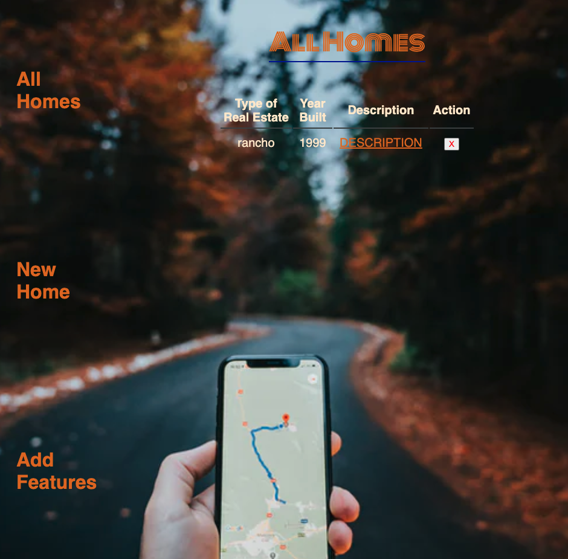

# Project 2

A simple web app that keep track of houses visited by a buyer

## technologies Used
- Invision (wireframe)
- lucy.app (ERD)
- Trello Board (https://trello.com/b/leSYWMqE/project-2)
- HTML5
- CSS3
- Node.js
- Express
- MongoDB 
- Github Pages (for saving)
- Heroku Pages (for depolyment)

## Screenshots

## Getting started
[click](https://homes-tracker.herokuapp.com/homes) here to get started and see the app online! 

## Future Enhancements
-Able to track more features
-More Unique design
-Add a GPS for location of the properties
